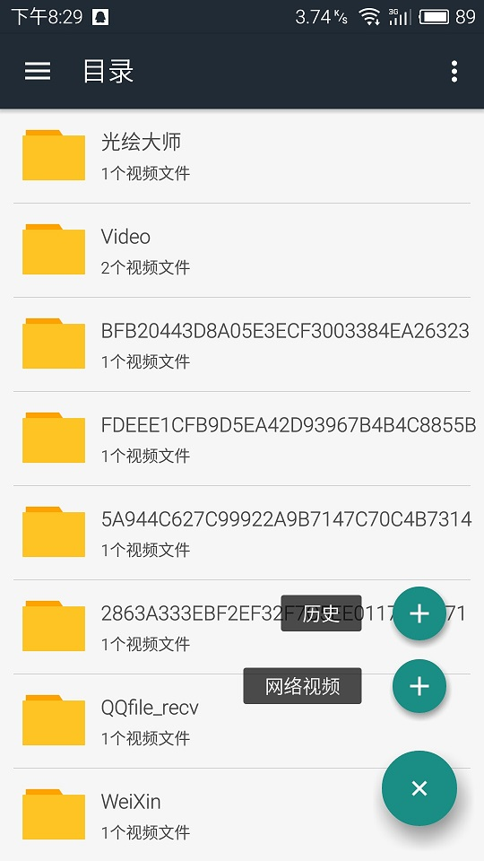
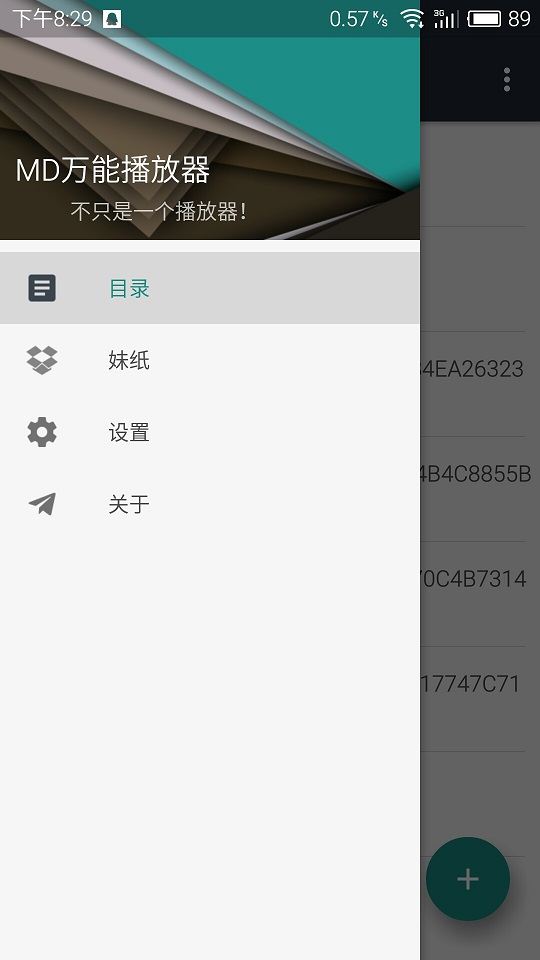
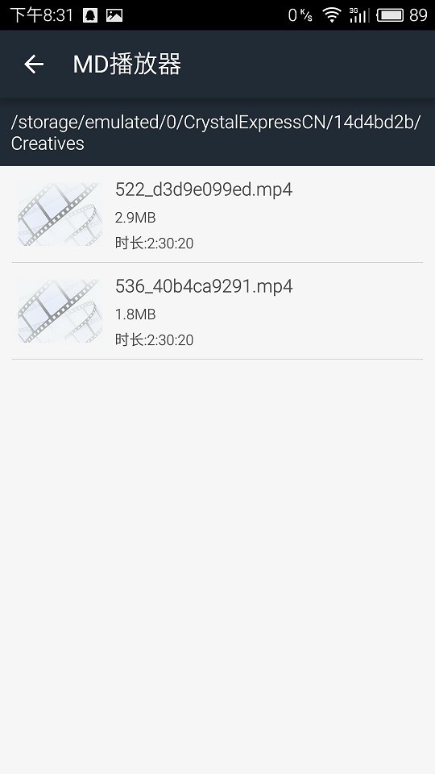
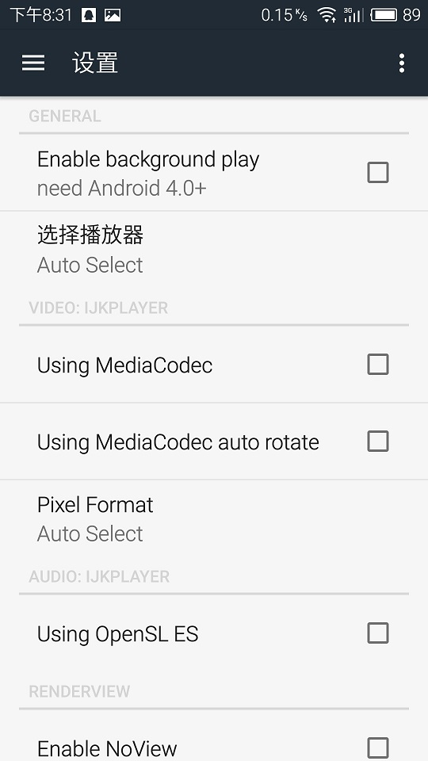
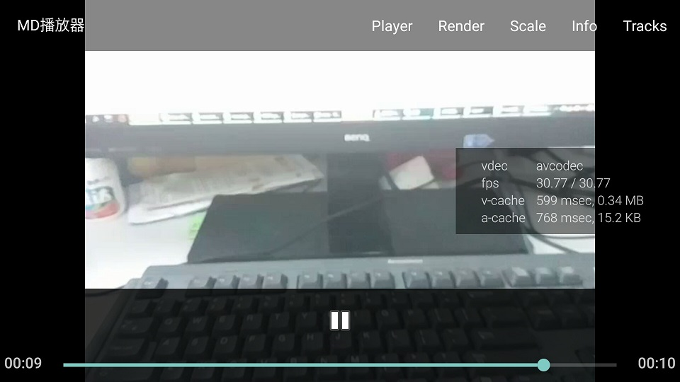

# MDPlayer万能播放器
#### MDPlayer，基于`ijkplayer`+`Rxjava`+`Rxandroid`+`Retrofit2.0`+`MVP`+`Material Design`的android万能播放器，可以播放本地和在线视频，可以浏览宅男杀手妹纸图片，UI设计遵循 Material Design。
#### 作者博客:[http://blog.csdn.net/u010072711](http://blog.csdn.net/u010072711)


----------

### MDPlayer 2.0最新GIF效果图:


### UI浏览:








### 1.UI设计:
- 列表使用`RecyclerView`，item为CardView并设置ripple波纹点击效果
- viewpager指示器使用`TabLayout`
- 侧滑栏使用`NavigationView`
- 图片详情使用开源控件PhotoView，支持大缩小，旋转等等操作。
- FloatingButton为开源控件`FloatingActionMenu`

### 2.App设计:
- 为`MVP`架构，第一次真正使用MVP，真的使用了才会发现MVP的优势，MVP可以使Activity和Fragment非常简洁，Activity和Fragment中也不需要知道是怎么操作和流转的，我们只需要在回调接口中操作更新UI就可以了。
- 所以得异步操作都使用`Rxjava+Rxandroid`，以前也是没用过，用过才发现、Rxjava是真的强大，Rxjava拥有非常丰富的操作符，我们灵活使用Rxjava可以创造无限可能，Rxjava就像搭建积木，Rxjava的操作符就行是积木块，使用Rxjava我们可以搭建出各种各种的积木，可以创造出很多可能，前提是你对Rxjava十分了解。
- 网络请求采用`retrofit2.0`，retrofit2.0本身就很强大，配合、Rxjava后就更加强大了，retrofit2.0的使用我还没有更加深入的研究，日后再搞。
- 离线缓存，离线缓存策略为，每次进入都是显示上一次的数据，本次的数据缓存下来，留着下一次显示，这样可以加快UI显示速度，可以离线使用App。
- 图片加载使用`picasso`，picasso本身支持本地缓存。

### 3.知识点:
通过本app你可以学到：
- `ijkplayer-android` 编译封装和集成
- MVP架构，虽然我的这个app不是很复杂，但是大概的MVP是有的，首先我承认我的Model层写得不是很好。
- 可以学习到Rxjava的使用，使用Rxjava递归读取内存所有的视频文件并分类，可以学习到`just`、`from`、`flatMap`、`groupBy`、`filter`等Rxjava操作符，相对别的app我用到的操作符相对还算多的。
- 学习到retrofit2.0的使用，结合Rxjava做网络请求。
- 离线缓存，可以学习到离线数据缓存策略，以及缓存工具的使用。
- `BaseActivity`、`BaseFragment`、`BaseRecyclerViewAdapter`和`BaseRecyclerViewHolder`的封装。
- Material Design和android5.0以后的新控件使用

### 4.依赖库：
```  java
    //FloatingActionMenu
    compile 'com.github.clans:fab:1.6.4'
    //retrofit
    compile 'com.squareup.retrofit:retrofit:2.0.0-beta2'
    compile 'com.squareup.retrofit:converter-gson:2.0.0-beta2'
    compile 'com.squareup.retrofit:adapter-rxjava:2.0.0-beta2'
    //Rxjava + Rxandroid
    compile 'io.reactivex:rxandroid:1.2.0'
    compile 'io.reactivex:rxjava:1.1.5'
    //blurview
    compile 'com.eightbitlab:blurview:1.0.2'
    //photoview
    compile 'com.bm.photoview:library:1.4.0'
    //picasso
    compile 'com.squareup.picasso:picasso:2.5.2'
    //umeng
    compile 'com.umeng.analytics:analytics:latest.integration'
```

### 5.APK下载：
上架中...

### 6.知识点引导：
- ijkplayer-android在ubuntu下编译请看我的文章：[http://blog.csdn.net/u010072711/article/details/51438871](http://blog.csdn.net/u010072711/article/details/51438871)
- Rxjava入门引导请看：[http://blog.csdn.net/u010072711/article/details/51590553](http://blog.csdn.net/u010072711/article/details/51590553)
- Android MVP+Retrofit+RxJava实践小结：[http://wuxiaolong.me/2016/06/12/mvpRetrofitRxjava/](http://wuxiaolong.me/2016/06/12/mvpRetrofitRxjava/)

### 7.下版本改进
- 下版本希望改进model层，对数据操作更加简洁
- 增加视频播放历史记录
- 自定义视频播控
- 使用注解替代findViewById
